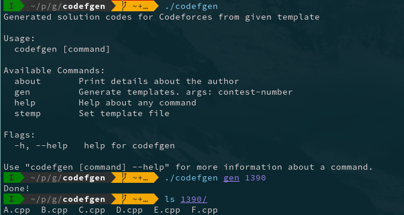

[](https://goreportcard.com/report/arnav127/codefgen) 
[](https://github.com/gojp/goreportcard/blob/master/LICENSE)
# Codefgen <br>
* Generated templates and copies sample cases from Codeforces *     
Codefgen is a program written in go which can be used to generate folder structure and program files for Codechef contests.  

When compiling from the source code, builing the program also executes the `install.sh` script which places the configuration files at the `~/.config/codefgen/` directory  

Execute `codefgen --help` to see the help and available commands

## Dump from the `--help` flag  
```
Generated solution codes for Codeforces from given template

Usage:
  codefgen [command]

Available Commands:
  about       Print details about the author
  gen         Generate templates. args: contest-number
  help        Help about any command
  stemp       Set template file

Flags:
  -h, --help   help for codefgen

Use "codefgen [command] --help" for more information about a command.
```

## Screenshots  

